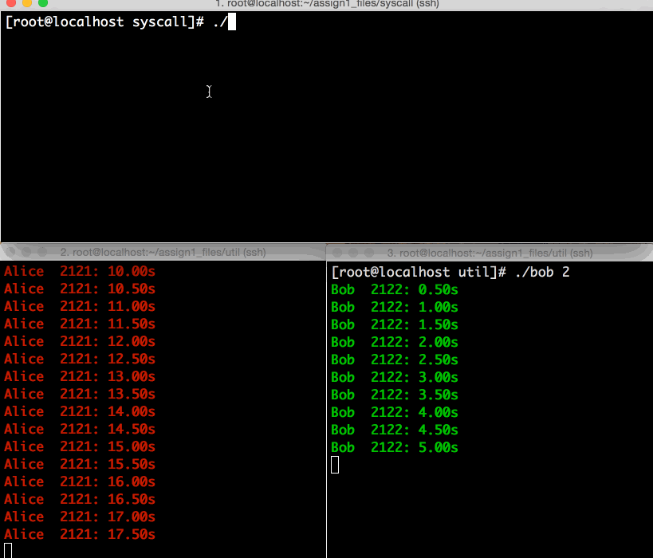

# ESTR 3102 Assignment 1 - an unfair scheduler


The Linux scheduler gives every process in the system a fair amount of CPU shares. In this assignment, you are going to modify the codes of the scheduler such that:

- You can register two processes through their PIDs using a new systems;
- Then, the new scheduler would give uneven CPU shares to the two processes.

## Specification

The specification can be found in this repo: [ESTR3102-assign1.pdf](ESTR3102-assign1.pdf). Note that this is an individual assignment.


## Showcasing Milestone 3



This animation illustrates:

1. The two processes running `alice.c` and `bob.c`, respectively, starting at different moments. The two program codes are similar; the only difference is the name that prints.

2. Normally, the two processes get a similar CPU share.

3. The `glue` program, which is one of the students' task, then sets the two PIDs of alice and bob processes, with an **uneven CPU share ratio of 1:2**.

  - The command:
    ```
    # glue 2121 2122 2
    ```
    is to submit the two PIDs into the kernel and requires a ratio of 1:2.

4. Then, the `top` program shows a 33:67 CPU share!

5. Further, we try the scheduling ratio of **1:20**. Then, the `top` program displays a rough ratio of 1:20 as well!

6. By the design of the assignment, when the younger process (bob) catches up with the older process (alice), the uneven scheduling stops and you can see the CPU share goes back to 1:1.

Is it an interesting assignment?

## Deadline and Demonstration

The deadline of this assignment is **16:30, 2015 Nov 6 (Friday)**. We will have demonstrations for every student:

1. You will run your program in front of the class using the projector!
2. You will explain your strategy in realizing the unfair scheduling scheme(s). The time limit is 5 minutes.
3. In addition to your presentation, the course instructor will ask you to demonstrate whether your program works according to the specification or not.
4. The course instructor will give marks right after your demonstration.
