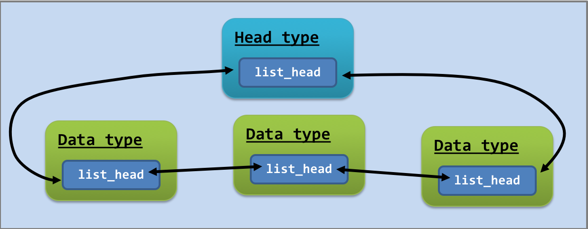

# Linux Kernel List API

## What is it?

It is a generic data structure implemented for the kernel. It is doubly linked list and implemented in header file.

Each API function are implemented as a `static inline` function so that those functions would not pollute the namespaces of other files.

You can find the API file (or the header file) `"list.h"` in this directory. The documentation of the API can be found in the following link: [https://www.kernel.org/doc/htmldocs/kernel-api/adt.html](https://www.kernel.org/doc/htmldocs/kernel-api/adt.html)

The following is a brief tutorial in using the `"list.h"` API. After reading the following tutorial, please complete the example inside the file `list_task.c` in order to practise your skill in using `list.h` API. Throughout the tutorial, we use the following structure:

```c
/** A data node type **/
struct data_type {
	int data;
	struct list_head list;
};
```

Note that the type `struct list_head` is the date type of `"list.h"` API.

### Initializing a list

```c
struct data_type node;
INIT_LIST_HEAD(&node.list);
```
`INIT_LIST_HEAD` is a macro that initialize the `struct list_head` variable. For the remaining field `int data`, your code has to initialize it separately.

### Best Practice

The best practice of using such an API is to have a head node connecting to a list of data nodes, as shown in the following figure:



### Adding a list item

```c
struct data_type head_node, new_node;
// initialize them //
list_add(&(new_node.list), &(head_node.list));
```

`list_add` is a function that puts a new node right after the head node.

The `list_add_tail` function puts a new node at the tail of the list.

### Deleting a list item

```c
struct data_type node;
// node is a member node in the list //
list_del(&(node.list));
```

### Traversing the list

```c
struct data_type head, *p;
// "head" is the head node
// "p" is for list traversal
list_for_each_entry(p, &(head.list), list) {
  // p is pointing to each member node in the list //
  printf("%d\n", p->data);
}
```

The `list_for_each` macro is a wrapper of the for loop.

Note that it is an anti-pattern that you delete list members while you are using `list_for_each_entry`. Instead, you should use `list_for_each_entry_safe`:

```c
struct data_type head, *p, *safe_p;
// "head" is the head node
// "p" is for list traversal
list_for_each_entry_safe(p, safe_p, &(head.list), list) {
  // p is pointing to each member node in the list //
  printf("%d\n", p->data);
  list_del(&(p->list));
}
```

## Use of Macro inside "list.h"

The list API makes use of a lot of ingenious ideas. In particular, the implementation of the "containerof" macro** worths highlighting. As a matter of fact, this is a super handy macro:

  ```c
  #define container_of(ptr, type, member) ({ \
    const typeof( ((type *)0)->member ) *__mptr = (ptr); \
    (type *)( (char *)__mptr - offsetof(type,member) );})
  ```

  This macro behaves like a function and *returns* the address of a structure by using any one of the structure's field.

  I know my description is not as illustrative than a code, please refer to the example code `container.c` in this directory.

  The implementation of the `"containerof"` macro has made use of other handy, but uncommon C features.

  - C Keyword: `typeof(variable)`. This "*function*" translates the type of the variable of its input during compilation.
    ```c
    int c;
    typeof(c) d;    // d will be an integer.
    ```
    In the example code `"typeof.c"`, you can find the use of `"typeof"` in creating a generic, variable-swapping macro.

  - C Keyword: `offsetof(type, struct_member)`. This keyword will measure the offset, in terms of bytes, of a member field inside structure. Again, it works during compilation.

  In the example code `"offsetof.c"`, we demonstrate the use of such keyword.

  - C Feature: **Compound statement is treated as an expression**. With [GCC](http://gcc.gnu.org/onlinedocs/gcc/Statement-Exprs.html), the following C code runs the value of `x`:
  ```c
  ({
        int x = 6;
        x;
  })
  ```
  To use such a trick, you have to include a compound statement inside a pair of parentheses. The example code `"block.c"` demonstrates such a feature.
